# Overview
- [Step 1: Create a new public Bucket in Backblaze](#step_1)
- [Step 2: Get the Public Name for your Bucket](#step_2)
- [Step 3: Add a CNAME record pointing to the friendly name for your bucket (Cloudflare Only)](#step_3)
- [Step 4: Set rewrite rules in your Cloudflare Rules (Cloudflare Only)](#step_4)
- [Step 5: Get your access credentials](#step_5)
- [Step 6: Add S3 environment variables to PieFed](#step_6)
- [Step 7: Troubleshooting and Extras](#step_7)


<a id="step_1"></a>

## Step 1: Create a new public Bucket in Backblaze

1. From the Buckets overview page, click **Create a Bucket**

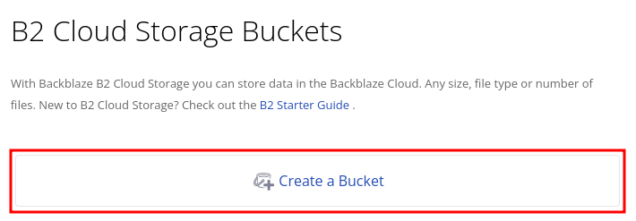

2. Give the Bucket a unique name

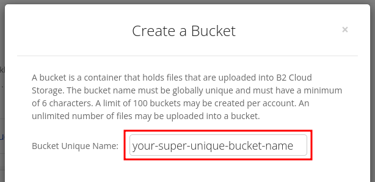

3. Set the Bucket to **Public**

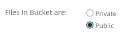

4. Click **Create a Bucket**

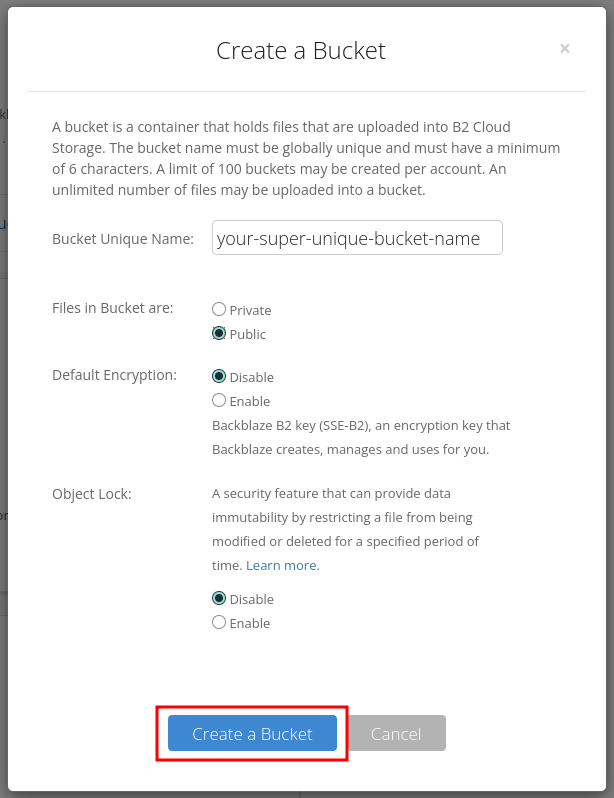

<a id="step_2"></a>

## Step 2: Get the Friendly Name for your Bucket

1. From the Buckets overview page, find your new bucket, and click **Upload/Download**

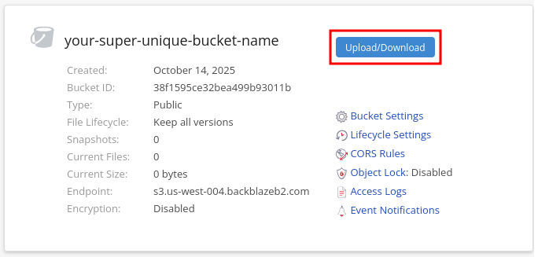

2. Drop or select a file (any file will work, but don't put anything private in this Bucket)

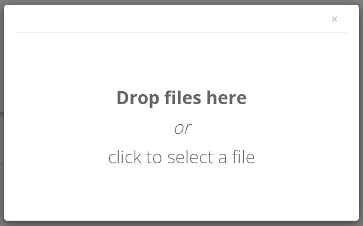


3. Click on the file you uploaded

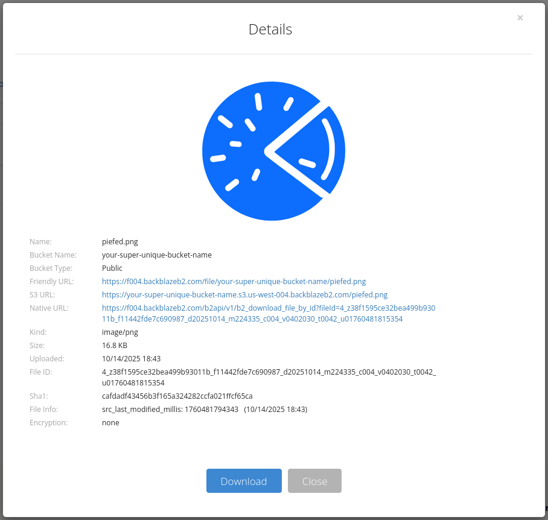

4. If you are using Cloudflare, get the part of the Friendly URL between the `https://` and the next `/`. In this case, that's `f004.backblazeb2.com`

5. If you are not using Cloudflare, get the S3 URL between the `https://` and leave off the trailing `/pifed.png`. For us, that's `your-super-unique-bucket-name.s3.us-west-004.backblazeb2.com`

<a id="step_3"></a>

## Step 3: Add a CNAME record pointing to the friendly name for your bucket (CF Only)

With Cloudflare, we can use our custom domain.
Backblaze doesn't natively support custom domains, so we work around by using Cloudflare settings:

First, we need a new **CNAME** record with these details under DNS settings on Cloudflare:

- **Name:** Whatever prefix you want to use for your media. We'll use `piefed-media`
- **Target:** The part of the Friendly URL you copied. In this case, that's `f004.backblazeb2.com`
- **Proxy status:** Enabled (orange)

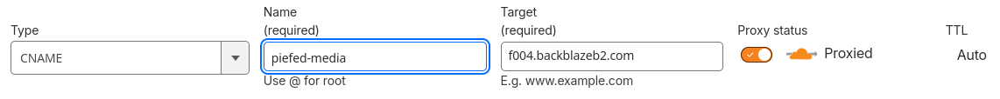

<a id="step_4"></a>

## Step 4: Set rewrite rules in your Cloudflare Rules (CF Only)

Next, add a rewrite the URL passed to Backblaze:

1. From the left-side menu, click on **Overview** under **Rules**

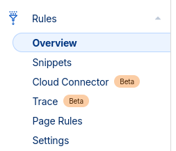

2. Click **Create rule**

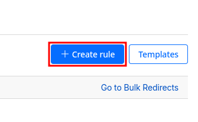

3. Give your rule a name. We'll use `piefed media`

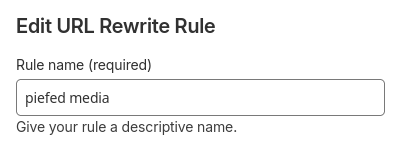

4. Under **If incoming requests match...**, choose **Custom filter expression**

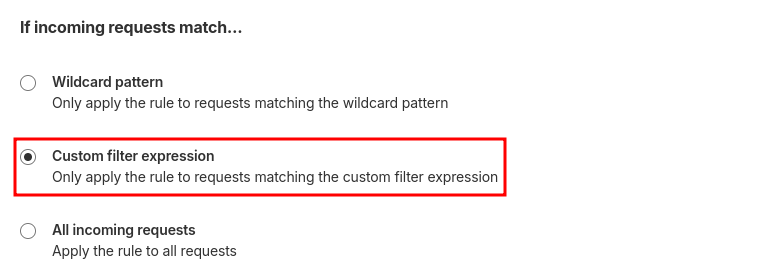

5. Under **When incoming requests match...**, set these values:
- **Field:** Hostname
- **Operator:** equals
- **Value:** The media CNAME you set up above. In our case that's `piefed-media.your.domain.here`

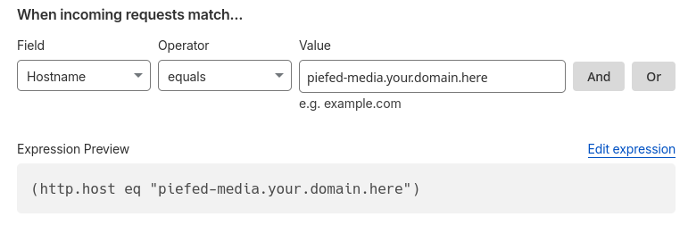

6. Under **Then...**, set these values:
- **Path:** Rewrite to...
    - Dynamic
    - `concat("/file/your-super-unique-bucket-name", http.request.uri.path)` (replace `your-super-unique-bucket-name` with the name of your Bucket)
- **Query:** Preserve

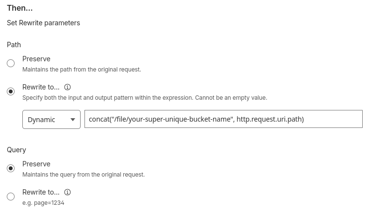

7. Click **Save**

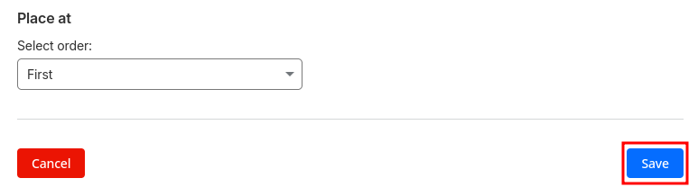

<a id="step_5"></a>

## Step 5: Get your access credentials

1. Head back to your Backblaze dashboard
2. Click **Application Keys** from the left-side menu

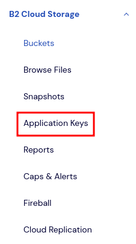

3. Click **Add a New Application Key**

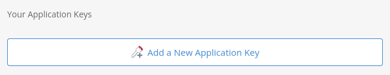

4. Enter these details:
- **Name of Key:** A name for your key. We'll use piefed-media
- **Allow access to Bucket(s):** Your new Bucket
- **Type of Access:** Read and Write
- **Allow List All Bucket Names:** Leave unchecked
- **File name prefix:** Leave blank
- **Duration:** Leave blank

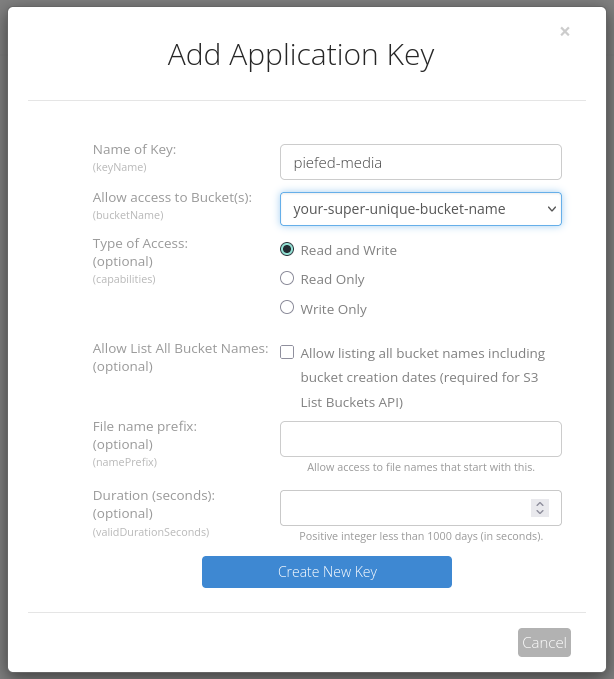

5. Click **Create New Key**

6. Take note of your **keyID** and **applicationKey**

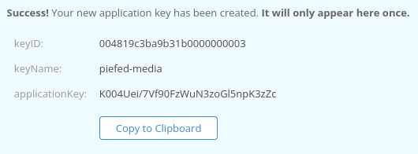

<a id="step_6"></a>

## Step 6: Add S3 environment variables to PieFed

1. Head back to your Backblaze dashboard and find these:
- **S3_BUCKET:** The name of your Bucket
- **S3_ENDPOINT:** The **Endpoint**
- **S3_REGION:** The part of the **Endpoint** between `s3.` and `.backblazeb2`

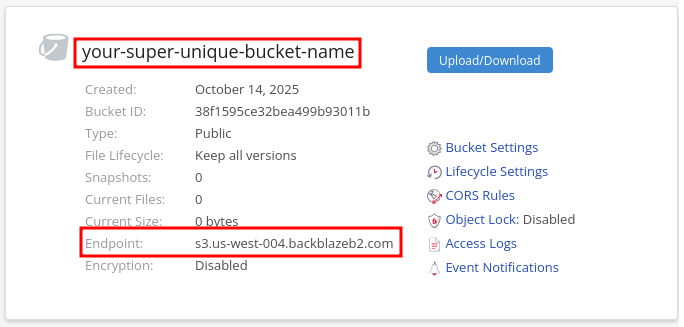

2. Add these values to your environment variables file (.env if you did the [manual install](https://codeberg.org/rimu/pyfedi/src/branch/main/INSTALL.md#setup-env-file), or .env.docker if you did the [docker install](https://codeberg.org/rimu/pyfedi/src/branch/main/INSTALL-docker.md#prepare-docker-environment-file)):

| **Key**              | **Value**                                                                               |
|----------------------|-----------------------------------------------------------------------------------------|
| **S3_BUCKET**        | The name of your Bucket                                                                 |
| **S3_ENDPOINT**      | The **Endpoint**                                                                        |
| **S3_REGION**        | The part of the **Endpoint** between `s3.` and `.backblazeb2`                           |
| **S3_PUBLIC_URL**    | If CF, the CNAME you created above. Our's was `piefed-media.your.domain.here`           |
| **-------------**    |                --------------------OR-----------------                                  |
| **S3_PUBLIC_URL**    | No CF, **S3 URL** from above `your-super-unique-bucket-name.s3.us-west-004.backblazeb2.com` , minus the piefed.png |
| **S3_ACCESS_KEY**    | Your **keyID**                                                                          |
| **S3_ACCESS_SECRET** | Your **applicationKey**                                                                 |


These are the values from our example:

```
S3_BUCKET = 'your-super-unique-bucket-name'
S3_ENDPOINT = 'https://s3.us-west-004.backblazeb2.com'
S3_REGION = 'us-west-004'

# For Cloudflare
S3_PUBLIC_URL = 'piefed-media.your.domain.here'

# For Non-Cloudflare
S3_PUBLIC_URL = 'your-super-unique-bucket-name.s3.us-west-004.backblazeb2.com'

S3_ACCESS_KEY = '004819c3ba9b31b0000000003'
S3_ACCESS_SECRET = 'K004Uei/7Vf90FzWuN3zoGl5npK3zZc'
```
That's it! Restart your instance and check Backblaze to make sure new files are showing up in your Bucket.

<a id="step_7"></a>

## Step 7: Troubleshooting and Extras

1. The main pyfedi.py app can perform some configuration checks, including your S3 configuration.

On Baremetal:

```
export FLASK_APP=pyfedi.py
source venv/bin/activate
flask config_check
```

For Docker:
```
docker exec -it piefed_app1 bash
export FLASK_APP=pyfedi.py
flask config_check
```

2. Move files to S3

You can kick off an immediate push of images to your S3 location.

**This can take a long time**

Please use a disconnectable terminal such as tmux or screen for this.

On Baremetal:

```
export FLASK_APP=pyfedi.py
source venv/bin/activate
flask move-files-to-s3
```

For Docker:
```
docker exec -it piefed_app1 bash
export FLASK_APP=pyfedi.py
flask move-files-to-s3
```


